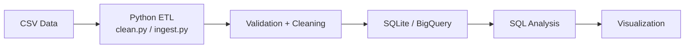

# Job Postings Fraud Analytics Pipeline

A Python-based ETL and analytics pipeline for detecting likely fraudulent job postings. The project cleans and validates raw job data, loads it into SQLite for SQL analysis, and visualizes fraud patterns across employment types.

## Problem Statement
Fake job postings often look legitimate at first glance but contain suspicious patterns such as missing information, unusually high fraud rates in certain employment types, or weak company signals. This project investigates those patterns using a repeatable data pipeline and a lightweight analytics workflow.

## Architecture



## Tech Stack
- Python
- pandas
- SQLite
- BigQuery
- matplotlib
- pytest
- Git

## Data Quality Summary
From the project data quality report:
- Raw rows: 17,880
- Duplicates removed: 0
- Rows failed validation: 346
- Final clean rows: 17,534

## SQL Insight
A key finding from the analysis is that part-time roles showed the highest fraud rate at 9.45%, compared with 4.21% for full-time postings, which suggests that job type is an important signal when evaluating suspicious listings.

## Visualization


## How to Run Locally
1. Create and activate a virtual environment.
2. Install dependencies:
   ```bash
   pip install pandas matplotlib pytest
   ```
3. Run the ingestion and cleaning pipeline:
   ```bash
   python src/ingest.py
   python src/clean.py
   ```
4. Load the cleaned dataset into SQLite:
   ```bash
   python src/load_db.py
   ```
5. Run SQL analysis:
   ```bash
   python src/run_queries.py
   ```
6. Create the visualization:
   ```bash
   python src/visualize.py
   ```
7. Run tests:
   ```bash
   pytest tests/test_validation.py
   ```

## Future Work
- Automate ingestion using Cloud Functions
- Schedule recurring ETL jobs with Cloud Scheduler
- Expand the pipeline to include BigQuery production workflows and dashboards

## Project Structure
```text
job-postings-pipeline/
├── data/
│   ├── fake_job_postings.csv
│   ├── cleaned_jobs.csv
│   └── job_postings.db
├── sql/
│   ├── queries.sql
│   ├── results.md
│   └── bigquery_results.md
├── src/
│   ├── ingest.py
│   ├── clean.py
│   ├── load_db.py
│   ├── run_queries.py
│   └── visualize.py
├── tests/
│   └── test_validation.py
├── data_quality_report.md
├── README.md
└── .gitignore
```
