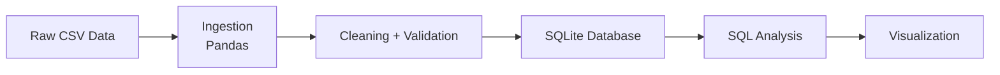
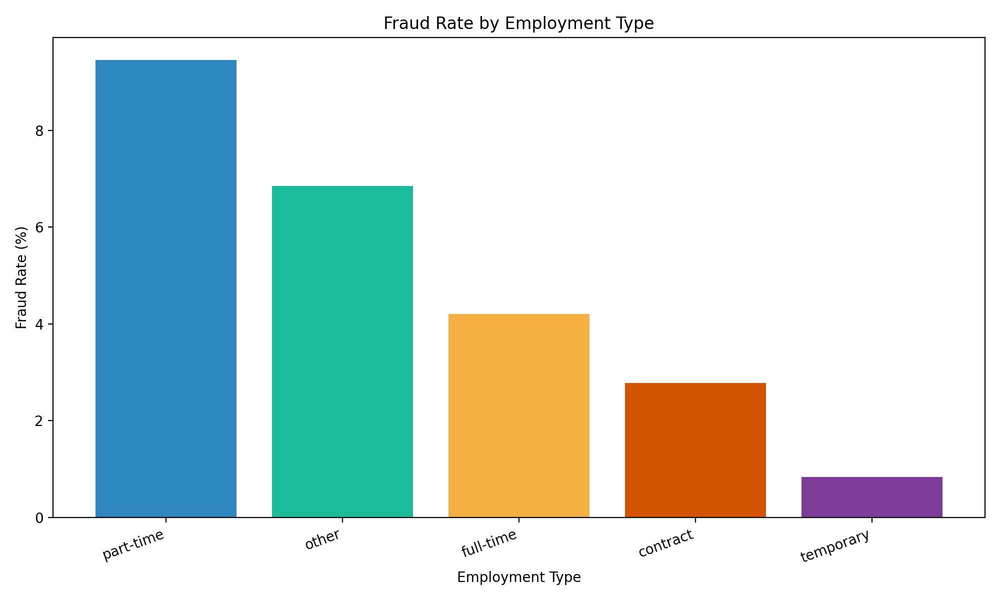

# Job Postings Fraud Analytics Pipeline

A Python pipeline for analyzing fake or suspicious job postings using data cleaning, validation, SQLite analysis, and visualization.

## Overview
This project uses a realistic job-posting dataset to detect patterns associated with fraudulent employment listings. The pipeline loads raw CSV data, validates and cleans records, stores the results in SQLite, runs SQL analysis, and produces a simple fraud-rate visualization.

## Why this project
Fake job listings are often difficult to distinguish from legitimate postings without a structured review process. This project builds a repeatable workflow to:

- inspect raw data quality
- standardize and validate records
- detect suspicious patterns in job metadata
- analyze fraud rates by job type and category
- visualize key findings for quick review

## Architecture



## Data Quality Snapshot
The cleaned dataset currently contains:

- Raw rows: 17,880
- Duplicates removed: 0
- Rows failed validation: 346
- Final clean rows: 17,534

## Key Findings
The analysis shows that fraud risk is not evenly distributed across job attributes.

- Part-time postings had the highest fraud rate at 9.45%
- Full-time postings were lower at 4.21%
- Roles with missing or weak company indicators showed greater fraud risk
- Company logo presence was associated with materially lower fraud rates

## Visualization



## Project Structure

```text
job-postings-pipeline/
├── data/
│   ├── fake_job_postings.csv
│   ├── cleaned_jobs.csv
│   └── job_postings.db
├── plots/
│   └── fraud_by_employment_type.png
├── sql/
│   ├── queries.sql
│   └── results.md
├── src/
│   ├── ingest.py
│   ├── clean.py
│   ├── load_db.py
│   ├── run_queries.py
│   └── visualize.py
├── tests/
│   └── test_validation.py
├── .gitignore
├── data_quality_report.md
├── README.md
└── PROJECT_STATUS.md
```

## Tech Stack

- Python
- pandas
- SQLite
- SQL
- matplotlib
- pytest
- Git and GitHub

## How to Run Locally

1. Create and activate a virtual environment.
2. Install dependencies:

```bash
pip install pandas matplotlib pytest
```

3. Run the ingestion and cleaning scripts:

```bash
python src/ingest.py
python src/clean.py
```

4. Load the cleaned data into SQLite:

```bash
python src/load_db.py
```

5. Run the SQL queries and save results:

```bash
python src/run_queries.py
```

6. Generate the chart:

```bash
python src/visualize.py
```

7. Run the validation tests:

```bash
pytest tests/test_validation.py
```

## Validation Coverage
The project includes pytest checks for:

- valid rows passing validation
- missing title rejection
- missing location rejection
- invalid `fraudulent` flag rejection
- malformed salary formatting rejection

## Future Work

- migrate the cleaned dataset to BigQuery
- automate ingestion and ETL with Cloud Functions
- schedule recurring data updates via Cloud Scheduler
- add more advanced fraud-feature modeling and dashboarding

## License
This project is intended for learning, analysis, and portfolio demonstration purposes.

